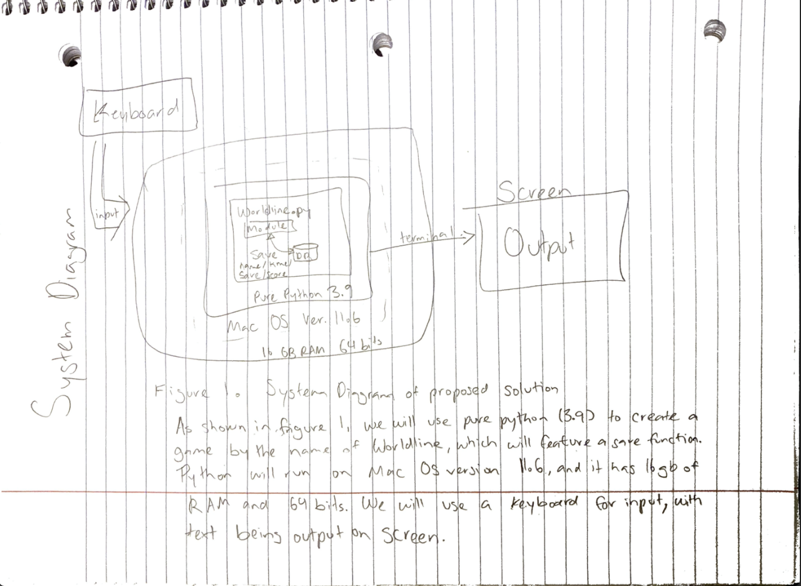

# Unit 1: A classic game 

# Criteria A: Planning

## Problem definition

The owner of the local game shop is an enthusiast of classic computer games. He has been looking for a talented programmer that can help him revive his passion for text-based games. He has few requirements for this task:

1. The game has to be entirely text-based.
2. The game must record the time played.
3. The game must record the player name and score.

Apart for this requirements, the owner is open to any type of game, topic or genre.

## Proposed Solution

Client requested a game that includes elements that are thought provoking, replayable, and has worldbuilding. Solution: focus on writing, make puzzle style (player must figure out answer and type in), while also giving multiple choice conversation outside of puzzles (eg. dialogue). Helps to give the player a challenge through having to do problems or remembering things discovered in the past, while maintaining conversation with characters that commentate on society and such, making players take thoughts outside of the game. Python is perfect as it can use both number and word values and has ability to correlate words typed such as “search” to actions in code.

## Success Criteria

I will design and make a videogame for a client who is a local game store. The game will be made in  Pure Python and is constructed using the software python. It will take  3-4 weeks to make and will be evaluated according to the criteria:

Stores progress in game, inventory pickup, score, and times died
Can respond to words typed by user with meaningful response
Retain commands that can check score, inventory, progress, and word key
Records flawless runs

# Criteria B: Design

## System Diagram

## Flow Diagrams

## Record of Tasks
| Task No | Planned Action | Planned Outcome | Time estimate | Target completion date | Criterion |
|---------|----------------|-----------------|---------------|------------------------|-----------|
|         |                |                 |               |                        |           |
|         |                |                 |               |                        |           |
|         |                |                 |               |                        |           |
